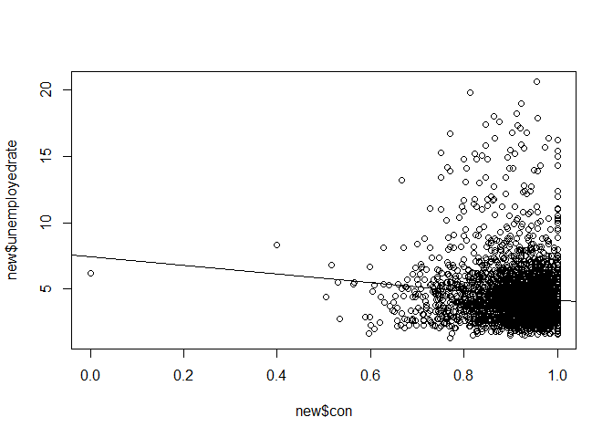

prpa
================

``` r
library(choroplethrMaps)
library(data.table)
library(tidyverse)
```

    ## -- Attaching packages ------------------------------------------------------ tidyverse 1.2.1 --

    ## v ggplot2 2.2.1     v purrr   0.2.4
    ## v tibble  1.4.2     v dplyr   0.7.4
    ## v tidyr   0.8.0     v stringr 1.2.0
    ## v readr   1.1.1     v forcats 0.2.0

    ## -- Conflicts --------------------------------------------------------- tidyverse_conflicts() --
    ## x dplyr::between()   masks data.table::between()
    ## x dplyr::filter()    masks stats::filter()
    ## x dplyr::first()     masks data.table::first()
    ## x dplyr::lag()       masks stats::lag()
    ## x dplyr::last()      masks data.table::last()
    ## x purrr::transpose() masks data.table::transpose()

``` r
library(choroplethr)
```

    ## Loading required package: acs

    ## Loading required package: XML

    ## 
    ## Attaching package: 'acs'

    ## The following object is masked from 'package:dplyr':
    ## 
    ##     combine

    ## The following object is masked from 'package:base':
    ## 
    ##     apply

``` r
setwd("C:/Users/xi97x/Desktop/479")
dat=read_csv("2017.txt")
```

    ## Parsed with column specification:
    ## cols(
    ##   .default = col_character(),
    ##   RECORD_TYPE_005A = col_integer(),
    ##   ROUTE_PREFIX_005B = col_integer(),
    ##   SERVICE_LEVEL_005C = col_integer(),
    ##   DIRECTION_005E = col_integer(),
    ##   PLACE_CODE_004 = col_integer(),
    ##   MIN_VERT_CLR_010 = col_double(),
    ##   KILOPOINT_011 = col_double(),
    ##   BASE_HWY_NETWORK_012 = col_integer(),
    ##   SUBROUTE_NO_013B = col_integer(),
    ##   LAT_016 = col_integer(),
    ##   DETOUR_KILOS_019 = col_integer(),
    ##   TOLL_020 = col_integer(),
    ##   YEAR_BUILT_027 = col_integer(),
    ##   TRAFFIC_LANES_ON_028A = col_integer(),
    ##   TRAFFIC_LANES_UND_028B = col_integer(),
    ##   ADT_029 = col_integer(),
    ##   YEAR_ADT_030 = col_integer(),
    ##   DESIGN_LOAD_031 = col_integer(),
    ##   APPR_WIDTH_MT_032 = col_double(),
    ##   MEDIAN_CODE_033 = col_integer()
    ##   # ... with 54 more columns
    ## )

    ## See spec(...) for full column specifications.

    ## Warning in rbind(names(probs), probs_f): number of columns of result is not
    ## a multiple of vector length (arg 1)

    ## Warning: 58710 parsing failures.
    ## row # A tibble: 5 x 5 col     row col             expected   actual file       expected   <int> <chr>           <chr>      <chr>  <chr>      actual 1 13457 DESIGN_LOAD_031 an integer A      '2017.txt' file 2 14084 DESIGN_LOAD_031 an integer A      '2017.txt' row 3 15077 DESIGN_LOAD_031 an integer A      '2017.txt' col 4 15293 DESIGN_LOAD_031 an integer A      '2017.txt' expected 5 15567 DESIGN_LOAD_031 an integer A      '2017.txt'
    ## ... ................. ... .................................................... ........ .................................................... ...... .................................................... .... .................................................... ... .................................................... ... .................................................... ........ ....................................................
    ## See problems(...) for more details.

``` r
keep = c("STATE_CODE_001", "STRUCTURE_NUMBER_008" , "COUNTY_CODE_003", "LAT_016", "LONG_017", "TOLL_020" , "ADT_029"           ,      "YEAR_ADT_030" ,
         "YEAR_BUILT_027" , "DECK_COND_058" , "SUPERSTRUCTURE_COND_059", "SUBSTRUCTURE_COND_060"  , "CHANNEL_COND_061","CULVERT_COND_062", "DATE_OF_INSPECT_090"   ,  "FRACTURE_092A"     ,      "UNDWATER_LOOK_SEE_092B" , "SPEC_INSPECT_092C"  )

x = select(dat, one_of(keep))
x$STATE_CODE_001=as.numeric(x$STATE_CODE_001)
x$COUNTY_CODE_003=as.numeric(x$COUNTY_CODE_003)
Bridge = mutate (x,fips=STATE_CODE_001*1000+COUNTY_CODE_003)

wi = mutate(Bridge, cond = pmin(SUPERSTRUCTURE_COND_059, SUBSTRUCTURE_COND_060, CHANNEL_COND_061,CULVERT_COND_062, na.rm = T))


# good = 5:9
# bad = 2:4
# fail = 0:1
# cond "condition" is the minimum of the given ratings. 
rateIt = function(cond){
  # gives a good to fail rating for cond.
  rate = rep("good", length(cond))
  rate[cond<5] = "bad"
  rate[cond <2]= "fail"
  return(rate)
}
wi$rate = rateIt(wi$cond)

#load unempleyment data
library(blscrapeR)
library(dplyr)
library(choroplethr)  

unemployment = get_bls_county() %>% as.tbl

unemployment$fips=as.numeric(unemployment$fips)

data=wi %>% 
  inner_join(unemployment, by = "fips")


data$unemployed_rate=as.numeric(data$unemployed_rate)
data = data%>% mutate(good = (rate == "good"))
new=data %>%
  group_by(fips)%>%
  summarize(unemployedrate=mean(unemployed_rate),con=mean(good))

lm=lm(unemployedrate~con,new)
plot(y=new$unemployedrate,x=new$con)
abline(lm)
```


